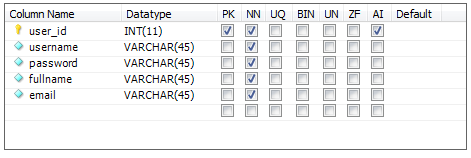

# SQL-CRUD

## Introduction

In the database programming, there are four basic and essential operations: create, read, update, and delete. 
These operations can be defined as the first step in database programming and are called CRUD operations. 
CRUD is an acronym of the CREATE, READ, UPDATE and DELETE words. 
The CRUD term was once mentioned by James Martin in his book ‘Managing the Database Environment’ and since then this term has become popular. 
In this article, we will explore the CRUD operation in terms of SQL Server because the operation syntax can differ from other relational and NoSQL databases. 
First of all, we will define the database table; a table is a database object which stores data. The table is based on the rows and columns. If you want to create a table, you need at least one column and this column must be of a data type.
The main idea of relational databases is that data is stored in tables. 
In addition, this table data can be read, inserted, deleted or edited by the CRUD operations. So CRUD operation is basically used to manipulate table data.

- CREATE – insert row/rows to table.
- READ – read (select) row/rows from a table.
- UPDATE – edit row/rows in the table.
- DELETE – delete row/rows in the table.

## How To Use This Document
There are 2 parts in each lession: introduction sql and then crud. 

- [SQL Tutorial](./sql.md)
- [CRUD](./crud.md)

## Home work
Using [Run SQL Online](https://www.w3schools.com/sql/trysql.asp?filename=trysql_create_table) to test your sql statement.
Pushing your answers in sql/crud/your_name branch. 

1. Let’s create a table Users with the following structure:

2. Let’s write code to insert a new record into the table Users with following details:
- username: bill
- password: secretpass
- fullname: Bill Gates
- email: bill.gates@microsoft.com

3. Let’s write code to queries all records from the Users table.

4. Let’s write code to update the record of “Bill Gates”.
- password: 123456789
- fullname: William Henry Bill Gates
- email: bill.gates@microsoft.com

5. Let’s write code to delete a record whose username field contains “bill”.
