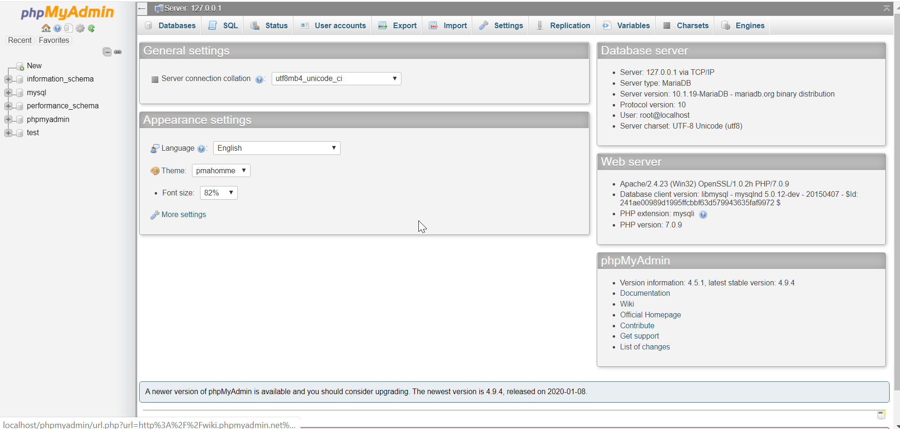
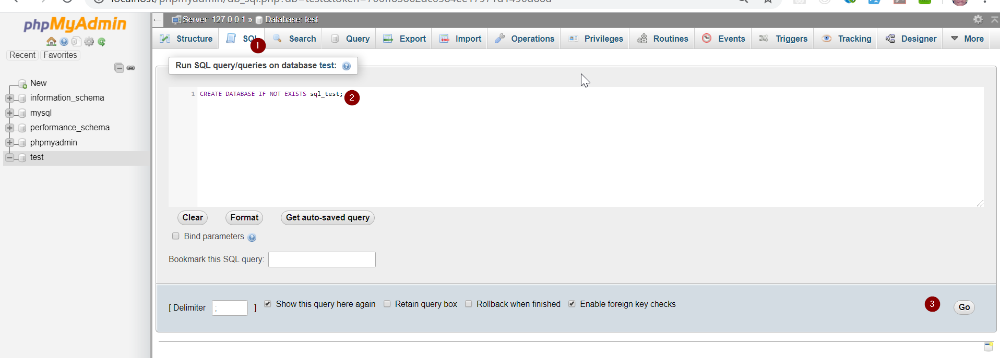
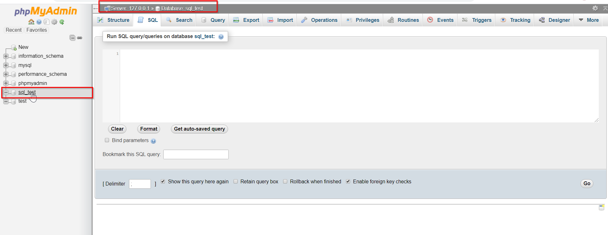
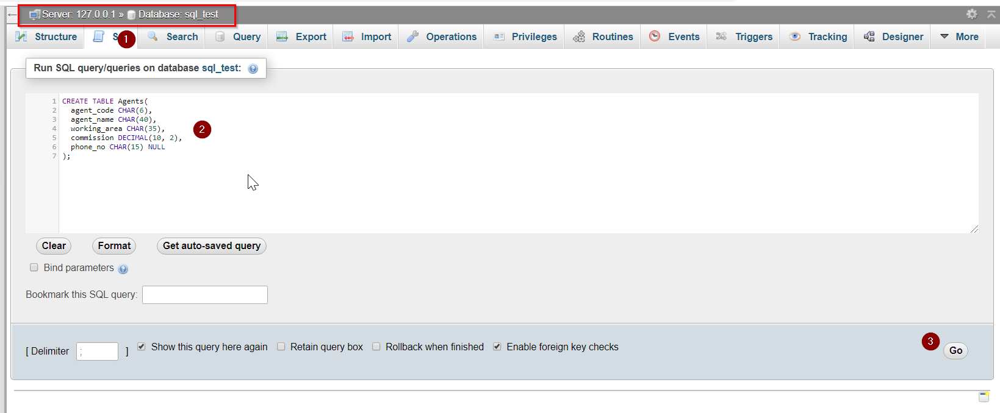
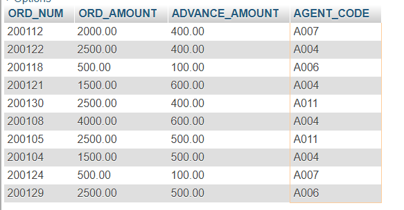
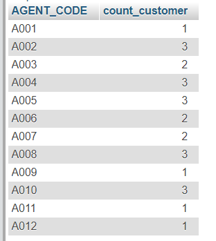
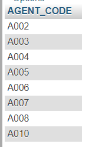

# SQL-CRUD

## Introduction

In the database programming, there are four basic and essential operations: create, read, update, and delete. 
These operations can be defined as the first step in database programming and are called CRUD operations. 
CRUD is an acronym of the CREATE, READ, UPDATE and DELETE words. 

The CRUD term was once mentioned by James Martin in his book ‘Managing the Database Environment’ and since then this term has become popular. 

In this article, we will explore the CRUD operation in terms of SQL Server because the operation syntax can differ from other relational and NoSQL databases. 

First of all, we will define the database table; a table is a database object which stores data. The table is based on the rows and columns. If you want to create a table, you need at least one column and this column must be of a data type.
The main idea of relational databases is that data is stored in tables. 

In addition, this table data can be read, inserted, deleted or edited by the CRUD operations. So CRUD operation is basically used to manipulate table data.

- CREATE – insert row/rows to table.
- READ – read (select) row/rows from a table.
- UPDATE – edit row/rows in the table.
- DELETE – delete row/rows in the table.

## Index

1. SQL 

- [Introduction to SQL](https://www.w3schools.com/sql/sql_intro.asp)
- [SQL Syntax](https://www.w3schools.com/sql/sql_syntax.asp)
- [SQL Create Database](https://www.w3schools.com/sql/sql_create_db.asp)
- [SQL AUTO INCREMENT ](https://www.w3schools.com/sql/sql_autoincrement.asp)
- [SQL PRIMARY KEY](https://www.w3schools.com/sql/sql_primarykey.asp)
- [SQL FOREIGN KEY](https://www.w3schools.com/sql/sql_foreignkey.asp)
- [SQL Drop Database](https://www.w3schools.com/sql/sql_drop_db.asp)
- [SQL Create Table](https://www.w3schools.com/sql/sql_create_table.asp)
- [SQL Drop Table](https://www.w3schools.com/sql/sql_drop_table.asp)
- [SQL Alter Table](https://www.w3schools.com/sql/sql_alter.asp)

2. CRUD
- [SQL INSERT INTO](https://www.w3schools.com/sql/sql_insert.asp)
- [SQL INSERT INTO SELECT](https://www.w3schools.com/sql/sql_insert_into_select.asp)
- [SQL SELECT INTO](https://www.w3schools.com/sql/sql_select_into.asp)
- [SQL SELECT](https://www.w3schools.com/sql/sql_select.asp)
- [SQL SELECT DISTINCT](https://www.w3schools.com/sql/sql_distinct.asp)
- [SQL UPDATE](https://www.w3schools.com/sql/sql_update.asp)
- [SQL DELETE](https://www.w3schools.com/sql/sql_delete.asp)

3. SQL Joins
- [SQL Joins](https://www.w3schools.com/sql/sql_join.asp)
- [SQL INNER JOIN](https://www.w3schools.com/sql/sql_join_inner.asp)
- [SQL LEFT JOIN](https://www.w3schools.com/sql/sql_join_left.asp)
- [SQL FULL OUTER JOIN](https://www.w3schools.com/sql/sql_join_full.asp)

4. SQL clauses
- [SQL GROUP BY](https://www.w3schools.com/sql/sql_groupby.asp)
- [SQL ORDER BY](https://www.w3schools.com/sql/sql_orderby.asp)
- [SQL HAVING](https://www.w3schools.com/sql/sql_having.asp)

5. MySQL Functions
- [Common Functions](https://www.w3schools.com/sql/sql_count_avg_sum.asp)
- [SQL MIN and MAX](https://www.w3schools.com/sql/sql_min_max.asp)
- [MySQL Functions](https://www.w3schools.com/sql/sql_ref_mysql.asp)

6. SQL Subqueries
- [SQL Subqueries](./subqueries.md)
- [SQL EXISTS](https://www.w3schools.com/sql/sql_exists.asp)
- [SQL ANY and ALL](https://www.w3schools.com/sql/sql_any_all.asp)

## Exercise SQL Database

### Precondition

1. [Install PHP environment for development](https://github.com/lappv/PAV-Training/blob/web-development/exercises/tut2.md)

2. Open [phpmyadmin](http://localhost/phpmyadmin/)



3. Create sql_test database

- SQL Code:

```sql
CREATE DATABASE IF NOT EXISTS sql_test;
```
- Step by step:



4. Select sql_test database



5. Table structure for table `agents`


- SQL Code:
```sql
CREATE TABLE IF NOT EXISTS `agents` (
  `AGENT_CODE` varchar(6) NOT NULL DEFAULT '',
  `AGENT_NAME` varchar(40) DEFAULT NULL,
  `WORKING_AREA` varchar(35) DEFAULT NULL,
  `COMMISSION` decimal(10,2) DEFAULT NULL,
  `PHONE_NO` varchar(15) DEFAULT NULL,
  `COUNTRY` varchar(25) DEFAULT NULL,
  PRIMARY KEY (`AGENT_CODE`)
) 
```
- Step by step:



6. Insert dummy data for table `agents`
- SQL Code:
```sql
INSERT INTO AGENTS VALUES ('A007', 'Ramasundar', 'Bangalore', '0.15', '077-25814763', '');
INSERT INTO AGENTS VALUES ('A003', 'Alex ', 'London', '0.13', '075-12458969', '');
INSERT INTO AGENTS VALUES ('A008', 'Alford', 'New York', '0.12', '044-25874365', '');
INSERT INTO AGENTS VALUES ('A011', 'Ravi Kumar', 'Bangalore', '0.15', '077-45625874', '');
INSERT INTO AGENTS VALUES ('A010', 'Santakumar', 'Chennai', '0.14', '007-22388644', '');
INSERT INTO AGENTS VALUES ('A012', 'Lucida', 'San Jose', '0.12', '044-52981425', '');
INSERT INTO AGENTS VALUES ('A005', 'Anderson', 'Brisban', '0.13', '045-21447739', '');
INSERT INTO AGENTS VALUES ('A001', 'Subbarao', 'Bangalore', '0.14', '077-12346674', '');
INSERT INTO AGENTS VALUES ('A002', 'Mukesh', 'Mumbai', '0.11', '029-12358964', '');
INSERT INTO AGENTS VALUES ('A006', 'McDen', 'London', '0.15', '078-22255588', '');
INSERT INTO AGENTS VALUES ('A004', 'Ivan', 'Torento', '0.15', '008-22544166', '');
INSERT INTO AGENTS VALUES ('A009', 'Benjamin', 'Hampshair', '0.11', '008-22536178', '');
```

7. Table structure for table `orders`
- SQL Code:
```sql
CREATE TABLE IF NOT EXISTS `orders`(
  `ORD_NUM` DECIMAL(6, 0) NOT NULL,
  `ORD_AMOUNT` DECIMAL(12, 2) NOT NULL,
  `ADVANCE_AMOUNT` DECIMAL(12, 2) NOT NULL,
  `ORD_DATE` DATE NOT NULL,
  `CUST_CODE` VARCHAR(6) NOT NULL,
  `AGENT_CODE` VARCHAR(6) NOT NULL,
  `ORD_DESCRIPTION` VARCHAR(60) NOT NULL
)
```

8. Insert dummy data for table `orders`
```sql
INSERT INTO ORDERS VALUES('200100', '1000.00', '600.00', '08/01/2008', 'C00013', 'A003', 'SOD');
INSERT INTO ORDERS VALUES('200110', '3000.00', '500.00', '04/15/2008', 'C00019', 'A010', 'SOD');
INSERT INTO ORDERS VALUES('200107', '4500.00', '900.00', '08/30/2008', 'C00007', 'A010', 'SOD');
INSERT INTO ORDERS VALUES('200112', '2000.00', '400.00', '05/30/2008', 'C00016', 'A007', 'SOD'); 
INSERT INTO ORDERS VALUES('200113', '4000.00', '600.00', '06/10/2008', 'C00022', 'A002', 'SOD');
INSERT INTO ORDERS VALUES('200102', '2000.00', '300.00', '05/25/2008', 'C00012', 'A012', 'SOD');
INSERT INTO ORDERS VALUES('200114', '3500.00', '2000.00', '08/15/2008', 'C00002', 'A008', 'SOD');
INSERT INTO ORDERS VALUES('200122', '2500.00', '400.00', '09/16/2008', 'C00003', 'A004', 'SOD');
INSERT INTO ORDERS VALUES('200118', '500.00', '100.00', '07/20/2008', 'C00023', 'A006', 'SOD');
INSERT INTO ORDERS VALUES('200119', '4000.00', '700.00', '09/16/2008', 'C00007', 'A010', 'SOD');
INSERT INTO ORDERS VALUES('200121', '1500.00', '600.00', '09/23/2008', 'C00008', 'A004', 'SOD');
INSERT INTO ORDERS VALUES('200130', '2500.00', '400.00', '07/30/2008', 'C00025', 'A011', 'SOD');
INSERT INTO ORDERS VALUES('200134', '4200.00', '1800.00', '09/25/2008', 'C00004', 'A005', 'SOD');
INSERT INTO ORDERS VALUES('200108', '4000.00', '600.00', '02/15/2008', 'C00008', 'A004', 'SOD');
INSERT INTO ORDERS VALUES('200103', '1500.00', '700.00', '05/15/2008', 'C00021', 'A005', 'SOD');
INSERT INTO ORDERS VALUES('200105', '2500.00', '500.00', '07/18/2008', 'C00025', 'A011', 'SOD');
INSERT INTO ORDERS VALUES('200109', '3500.00', '800.00', '07/30/2008', 'C00011', 'A010', 'SOD');
INSERT INTO ORDERS VALUES('200101', '3000.00', '1000.00', '07/15/2008', 'C00001', 'A008', 'SOD');
INSERT INTO ORDERS VALUES('200111', '1000.00', '300.00', '07/10/2008', 'C00020', 'A008', 'SOD');
INSERT INTO ORDERS VALUES('200104', '1500.00', '500.00', '03/13/2008', 'C00006', 'A004', 'SOD');
INSERT INTO ORDERS VALUES('200106', '2500.00', '700.00', '04/20/2008', 'C00005', 'A002', 'SOD');
INSERT INTO ORDERS VALUES('200125', '2000.00', '600.00', '10/10/2008', 'C00018', 'A005', 'SOD');
INSERT INTO ORDERS VALUES('200117', '800.00', '200.00', '10/20/2008', 'C00014', 'A001', 'SOD');
INSERT INTO ORDERS VALUES('200123', '500.00', '100.00', '09/16/2008', 'C00022', 'A002', 'SOD');
INSERT INTO ORDERS VALUES('200120', '500.00', '100.00', '07/20/2008', 'C00009', 'A002', 'SOD');
INSERT INTO ORDERS VALUES('200116', '500.00', '100.00', '07/13/2008', 'C00010', 'A009', 'SOD');
INSERT INTO ORDERS VALUES('200124', '500.00', '100.00', '06/20/2008', 'C00017', 'A007', 'SOD'); 
INSERT INTO ORDERS VALUES('200126', '500.00', '100.00', '06/24/2008', 'C00022', 'A002', 'SOD');
INSERT INTO ORDERS VALUES('200129', '2500.00', '500.00', '07/20/2008', 'C00024', 'A006', 'SOD');
INSERT INTO ORDERS VALUES('200127', '2500.00', '400.00', '07/20/2008', 'C00015', 'A003', 'SOD');
INSERT INTO ORDERS VALUES('200128', '3500.00', '1500.00', '07/20/2008', 'C00009', 'A002', 'SOD');
INSERT INTO ORDERS VALUES('200135', '2000.00', '800.00', '09/16/2008', 'C00007', 'A010', 'SOD');
INSERT INTO ORDERS VALUES('200131', '900.00', '150.00', '08/26/2008', 'C00012', 'A012', 'SOD');
INSERT INTO ORDERS VALUES('200133', '1200.00', '400.00', '06/29/2008', 'C00009', 'A002', 'SOD');
```

9. Table structure for table `customer`
- SQL Code:
```sql
CREATE TABLE IF NOT EXISTS `customer`(
  `CUST_CODE` VARCHAR(6) NOT NULL,
  `CUST_NAME` VARCHAR(40) NOT NULL,
  `CUST_CITY` VARCHAR(35) DEFAULT NULL,
  `WORKING_AREA` VARCHAR(35) NOT NULL,
  `CUST_COUNTRY` VARCHAR(20) NOT NULL,
  `GRADE` DECIMAL(10, 0) DEFAULT NULL,
  `OPENING_AMT` DECIMAL(12, 2) NOT NULL,
  `RECEIVE_AMT` DECIMAL(12, 2) NOT NULL,
  `PAYMENT_AMT` DECIMAL(12, 2) NOT NULL,
  `OUTSTANDING_AMT` DECIMAL(12, 2) NOT NULL,
  `PHONE_NO` VARCHAR(17) NOT NULL,
  `AGENT_CODE` VARCHAR(6) DEFAULT NULL,
  KEY `CUSTCITY`(`CUST_CITY`),
  KEY `CUSTCITY_COUNTRY`(`CUST_CITY`, `CUST_COUNTRY`)
)
```

10. Insert dummy data for table `customer`
```sql
INSERT INTO CUSTOMER VALUES ('C00013', 'Holmes', 'London', 'London', 'UK', '2', '6000.00', '5000.00', '7000.00', '4000.00', 'BBBBBBB', 'A003');
INSERT INTO CUSTOMER VALUES ('C00001', 'Micheal', 'New York', 'New York', 'USA', '2', '3000.00', '5000.00', '2000.00', '6000.00', 'CCCCCCC', 'A008');
INSERT INTO CUSTOMER VALUES ('C00020', 'Albert', 'New York', 'New York', 'USA', '3', '5000.00', '7000.00', '6000.00', '6000.00', 'BBBBSBB', 'A008');
INSERT INTO CUSTOMER VALUES ('C00025', 'Ravindran', 'Bangalore', 'Bangalore', 'India', '2', '5000.00', '7000.00', '4000.00', '8000.00', 'AVAVAVA', 'A011');
INSERT INTO CUSTOMER VALUES ('C00024', 'Cook', 'London', 'London', 'UK', '2', '4000.00', '9000.00', '7000.00', '6000.00', 'FSDDSDF', 'A006');
INSERT INTO CUSTOMER VALUES ('C00015', 'Stuart', 'London', 'London', 'UK', '1', '6000.00', '8000.00', '3000.00', '11000.00', 'GFSGERS', 'A003');
INSERT INTO CUSTOMER VALUES ('C00002', 'Bolt', 'New York', 'New York', 'USA', '3', '5000.00', '7000.00', '9000.00', '3000.00', 'DDNRDRH', 'A008');
INSERT INTO CUSTOMER VALUES ('C00018', 'Fleming', 'Brisban', 'Brisban', 'Australia', '2', '7000.00', '7000.00', '9000.00', '5000.00', 'NHBGVFC', 'A005');
INSERT INTO CUSTOMER VALUES ('C00021', 'Jacks', 'Brisban', 'Brisban', 'Australia', '1', '7000.00', '7000.00', '7000.00', '7000.00', 'WERTGDF', 'A005');
INSERT INTO CUSTOMER VALUES ('C00019', 'Yearannaidu', 'Chennai', 'Chennai', 'India', '1', '8000.00', '7000.00', '7000.00', '8000.00', 'ZZZZBFV', 'A010');
INSERT INTO CUSTOMER VALUES ('C00005', 'Sasikant', 'Mumbai', 'Mumbai', 'India', '1', '7000.00', '11000.00', '7000.00', '11000.00', '147-25896312', 'A002');
INSERT INTO CUSTOMER VALUES ('C00007', 'Ramanathan', 'Chennai', 'Chennai', 'India', '1', '7000.00', '11000.00', '9000.00', '9000.00', 'GHRDWSD', 'A010');
INSERT INTO CUSTOMER VALUES ('C00022', 'Avinash', 'Mumbai', 'Mumbai', 'India', '2', '7000.00', '11000.00', '9000.00', '9000.00', '113-12345678','A002');
INSERT INTO CUSTOMER VALUES ('C00004', 'Winston', 'Brisban', 'Brisban', 'Australia', '1', '5000.00', '8000.00', '7000.00', '6000.00', 'AAAAAAA', 'A005');
INSERT INTO CUSTOMER VALUES ('C00023', 'Karl', 'London', 'London', 'UK', '0', '4000.00', '6000.00', '7000.00', '3000.00', 'AAAABAA', 'A006');
INSERT INTO CUSTOMER VALUES ('C00006', 'Shilton', 'Torento', 'Torento', 'Canada', '1', '10000.00', '7000.00', '6000.00', '11000.00', 'DDDDDDD', 'A004');
INSERT INTO CUSTOMER VALUES ('C00010', 'Charles', 'Hampshair', 'Hampshair', 'UK', '3', '6000.00', '4000.00', '5000.00', '5000.00', 'MMMMMMM', 'A009');
INSERT INTO CUSTOMER VALUES ('C00017', 'Srinivas', 'Bangalore', 'Bangalore', 'India', '2', '8000.00', '4000.00', '3000.00', '9000.00', 'AAAAAAB', 'A007');
INSERT INTO CUSTOMER VALUES ('C00012', 'Steven', 'San Jose', 'San Jose', 'USA', '1', '5000.00', '7000.00', '9000.00', '3000.00', 'KRFYGJK', 'A012');
INSERT INTO CUSTOMER VALUES ('C00008', 'Karolina', 'Torento', 'Torento', 'Canada', '1', '7000.00', '7000.00', '9000.00', '5000.00', 'HJKORED', 'A004');
INSERT INTO CUSTOMER VALUES ('C00003', 'Martin', 'Torento', 'Torento', 'Canada', '2', '8000.00', '7000.00', '7000.00', '8000.00', 'MJYURFD', 'A004');
INSERT INTO CUSTOMER VALUES ('C00009', 'Ramesh', 'Mumbai', 'Mumbai', 'India', '3', '8000.00', '7000.00', '3000.00', '12000.00', 'Phone No', 'A002');
INSERT INTO CUSTOMER VALUES ('C00014', 'Rangarappa', 'Bangalore', 'Bangalore', 'India', '2', '8000.00', '11000.00', '7000.00', '12000.00', 'AAAATGF', 'A001');
INSERT INTO CUSTOMER VALUES ('C00016', 'Venkatpati', 'Bangalore', 'Bangalore', 'India', '2', '8000.00', '11000.00', '7000.00', '12000.00', 'JRTVFDD', 'A007');
INSERT INTO CUSTOMER VALUES ('C00011', 'Sundariya', 'Chennai', 'Chennai', 'India', '3', '7000.00', '11000.00', '7000.00', '11000.00', 'PPHGRTS', 'A010');
```

## Exercise 1

### Problem 

Write a query to extract the data from the orders table for those agents who earned the maximum commission.

### Solution

1. Get maximum commission
2. Get all agents have same maximum commission
3. Get all orders of the agents

Based on the ablove step-by-step, we will have 3 subselect:

1. Get maximum commission

- SQL Code:

```sql
SELECT MAX(commission) 
FROM `agents`
```

- Output:

|MAX(commission)|

|---------------|

|0.15           |

2. Get all agents have same maximum commission

- SQL Code:
```sql
SELECT
  AGENT_CODE
FROM
  `agents`
WHERE
  commission = 0.15
```

- Output:

|AGENT_CODE|

|----------|

|A004      |

|A006      |

|A007      |

|A011      |

3. Get all orders of the agents

- SQL Code:
```sql
SELECT
  ORD_NUM,
  ORD_AMOUNT,
  ADVANCE_AMOUNT,
  AGENT_CODE
FROM
  orders
WHERE
  AGENT_CODE IN('A004', 'A006', 'A007', 'A011')
```

- Output:



You can combine the above three queries by placing one query inside the other. See the following code and query result :

SQL Code:

```sql
SELECT
  ORD_NUM,
  ORD_AMOUNT,
  ADVANCE_AMOUNT,
  AGENT_CODE
FROM
  orders
WHERE
  AGENT_CODE IN(
  SELECT
    AGENT_CODE
  FROM
    `agents`
  WHERE
    commission =(
  SELECT MAX(commission)
  FROM
    `agents`
));
```

## Exercise 2

### Problem 

Write a update query to modified value for 'commission' is 'commission'+.02 for agents who have greater than or equal to two 'customer'.

### Solution

1. Find count of customer each agents

- SQL Code:

```sql
SELECT
  `customer`.`AGENT_CODE`,
  COUNT(`customer`.`AGENT_CODE`) AS count_customer
FROM
  `customer`
GROUP BY
  `customer`.`AGENT_CODE`
```

- Output:



On the above sql, We use **GROUP BY** to group agents by **AGENT_CODE**

2. Get agents who have greater than or equal to two 'customer'

- SQL Code:

```sql
SELECT
 `agents`.`AGENT_CODE`
FROM
 `agents`
WHERE
  (SELECT COUNT(`customer`.`AGENT_CODE`)
FROM
  `customer`
WHERE `customer`.`AGENT_CODE` = `agents`.`AGENT_CODE`) >= 2 
```

- Output:



When using subqueries, we can use **WHERE** clause instead of **GROUP BY**.

3. Update 'commission' is 'commission'+.02

- SQL Code:

```sql
UPDATE 
  `agents`
SET COMMISSION=COMMISSION+.02
WHERE
  AGENT_CODE IN('A002', 'A003', 'A004', 'A005', 'A006', 'A007', 'A008', 'A010')
```

How can we combine point 2 and 3? We only change select subqueries to update subqueries.

- SQL Code:

```sql
UPDATE 
  `agents`
SET COMMISSION=COMMISSION+.02
WHERE
  (SELECT COUNT(`customer`.`AGENT_CODE`)
FROM
  `customer`
WHERE `customer`.`AGENT_CODE` = `agents`.`AGENT_CODE`) >= 2 
```

## Home work

1. (**Easy**) Create a new table like as agents table named 'new_agents'. 
Insert records into 'new_agents' table from 'agents' table with the following condition:
- 'WORKING_AREA' of 'agents' table must be 'London'
- 'CUST_COUNTRY' of 'customer' table must be 'UK'

2. (**Normal**) Write a update query to modified value for 'commission' is 'commission'-.02 for agents who have minimum payment amount of 'customer' table.

2. (**Hard**) Write a query to extract the data from the 'customer' table who are in grade 3 and not belongs to the country India and there deposited opening amount is less than 7000 and their agents should have earned a commission is less than .12%.

