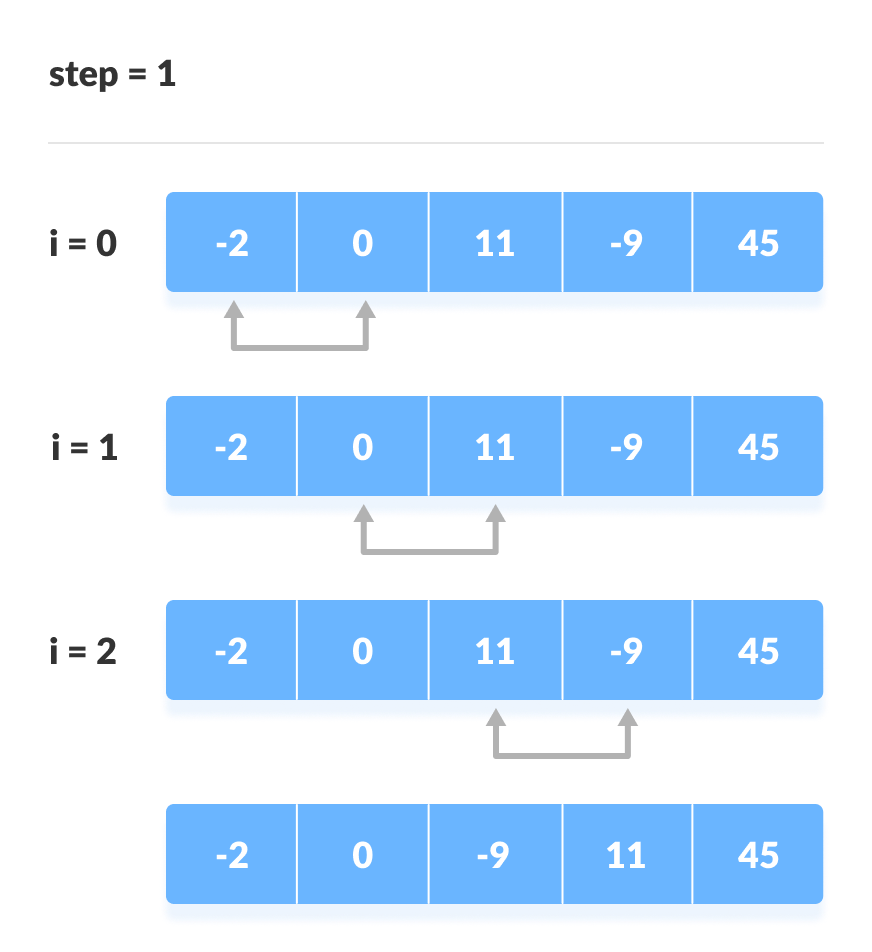

# Bubble sort

Bubble sort is an algorithm that compares the adjacent elements and swaps their positions if they are not in the intended order. The order can be ascending or descending.

## Problem to Solve

Given a list of numbers as shown below, please sort them in ascending order.
```php
$numbers = [-2, 45, 0, 11, -9];
```

## Pseudocode

Bubble Sort works by comparing two values at a time and does it pair by pair. And it iterates until all elements are in place. 
After each iteration, at least one element is moved to the end of the list. Below is an illustration of Bubble Sort.

### How Bubble Sort Works?
1. Starting from the first index, compare the first and the second elements.If the first element is greater than the second element, they are swapped. Now, compare the second and the third elements. Swap them if they are not in order. The above process goes on until the last element.


2. The same process goes on for the remaining iterations. After each iteration, the largest element among the unsorted elements is placed at the end. In each iteration, the comparison takes place up to the last unsorted element. The array is sorted when all the unsorted elements are placed at their correct positions.




### Pseudocode of Bubble Sort algorithm can be written as follows:

```php
bubbleSort(array)
  for i <- 1 to indexOfLastUnsortedElement-1
    if leftElement > rightElement
      swap leftElement and rightElement
end bubbleSort
```

## Implementation

### Following is the implementations of Bubble Sort.

```php
<?php  
// PHP program for implementation  
// of Bubble Sort 
  
function bubbleSort(&$arr) 
{ 
    $n = sizeof($arr); 
  
    // Traverse through all array elements 
    for($i = 0; $i < $n; $i++)  
    { 
        // Last i elements are already in place 
        for ($j = 0; $j < $n - $i - 1; $j++)  
        { 
            // traverse the array from 0 to n-i-1 
            // Swap if the element found is greater 
            // than the next element 
            if ($arr[$j] > $arr[$j+1]) 
            { 
                $t = $arr[$j]; 
                $arr[$j] = $arr[$j+1]; 
                $arr[$j+1] = $t; 
            } 
        } 
    } 
} 
  
// Driver code to test above 
$arr = array(5, 3, 1, 9, 8, 2, 4, 7); 
  
$len = sizeof($arr); 
bubbleSort($arr); 
  
echo "Sorted array : \n"; 
  
for ($i = 0; $i < $len; $i++) 
    echo $arr[$i]." ";  
  
?> 
```

### Output 

```php
Sorted array:
1 2 3 4 5 7 8 9
```


## Optimized Implementation:

In the above code, all possible comparisons are made even if the array is already sorted. It increases the execution time.

The code can be optimized by introducing an extra variable **swapped**. After each iteration, if there is no swapping taking place then, there is no need for performing further loops.

In such case, variable **swapped** is set false. Thus, we can prevent further iterations.

### Pseudocode of Bubble Sort algorithm can be written as follows:

```php
bubbleSort(array)
  swapped <- false
  for i <- 1 to indexOfLastUnsortedElement-1
    if leftElement > rightElement
      swap leftElement and rightElement
      swapped <- true
end bubbleSort
```


```php
<?php  
// PHP Optimized implementation 
// of Bubble sort 
  
// An optimized version of Bubble Sort 
function bubbleSort(&$arr) 
{ 
    $n = sizeof($arr); 
  
    // Traverse through all array elements 
    for($i = 0; $i < $n; $i++) 
    { 
        $swapped = False; 
  
        // Last i elements are already 
        // in place 
        for ($j = 0; $j < $n - $i - 1; $j++) 
        { 
              
            // traverse the array from 0 to 
            // n-i-1. Swap if the element  
            // found is greater than the 
            // next element 
            if ($arr[$j] > $arr[$j+1]) 
            { 
                $t = $arr[$j]; 
                $arr[$j] = $arr[$j+1]; 
                $arr[$j+1] = $t; 
                $swapped = True; 
            } 
        } 
  
        // IF no two elements were swapped 
        // by inner loop, then break 
        if ($swapped == False) 
            break; 
    } 
} 
          
// Driver code to test above 
$arr = array(5, 3, 1, 9, 8, 2, 4, 7); 
$len = sizeof($arr); 
bubbleSort($arr); 
  
echo "Sorted array : \n"; 
  
for($i = 0; $i < $len; $i++) 
    echo $arr[$i]." "; 
      
?> 
```

## Analysis

- Time Complexity: O(n^2). 

- Auxiliary Space: O(1)
