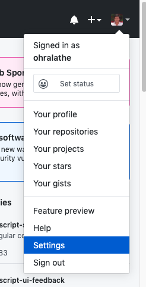
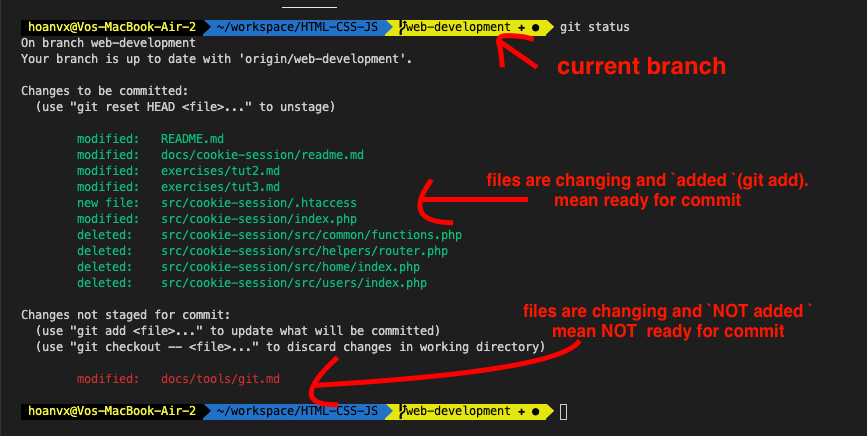
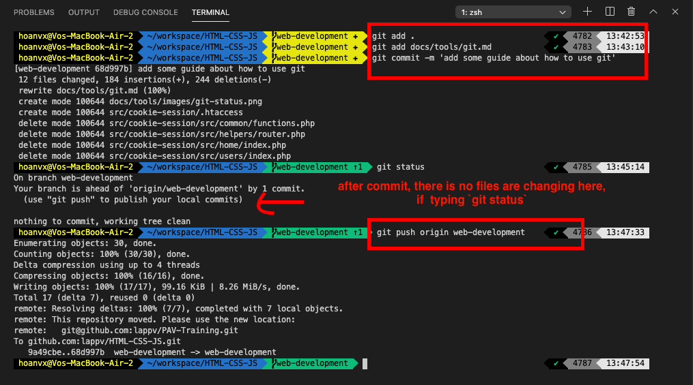
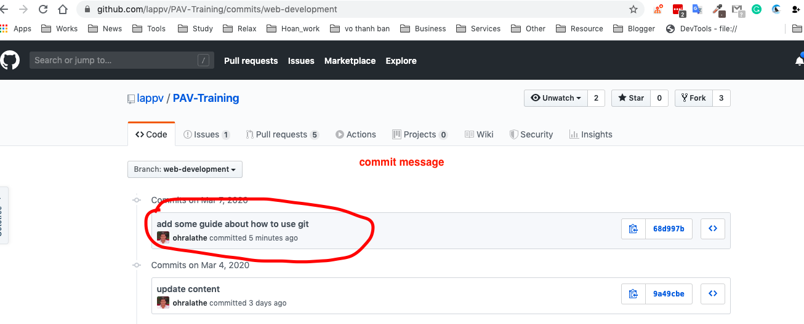

# Overview
In Software developmenent, there are many things to do such as get the requirements from customer, analysts the requirement, coding, test, deploy, etc.

Each phrase, you need a tool to do it. for instance, you may need the microsft office (words, execel) to note the requirement from the customer and transfer that document to develop team.

In coding phrase, to easier in coding and develop fast, support debugger, etc, you may have a good editor, for example, if you are PHP develop, you may need `PHP Storm` or `Visual studio code`.

And to save your source code and manage the source was contribute from other team member. `git` is a good choice. In the past, `SVN` is famouse, but now, it's `git`.

This section will introduce you about some common tools and some basic knowledge about tools using for development.


# Tools
___
## 1. Git
### 1.1 What is git?
Git is `version control system`. It's free and open source. Git supplies you an easy way to manage the verion of your source code.

### 1.2 Why git?
- Save your source code safe.
- Git small and fast. [Benchmarks here](https://git-scm.com/about/small-and-fast)
- Easier when you want to revert previouse code version
- Resolve the conflict easier


### 1.3 How to use.
I will introduce to you some basic and ussually to use when you are working.

There are many git services that was implemented from `git` and allow you use without fee (free) such as [GitHub](https://github.com), [GitLab](https://gitlab.com), [Atlassian](https://www.atlassian.com/git)

In this one, I `use Github to make example`. Here is some steps to do that.

- Install Git client
- [Register](https://github.com/) an account
- Create a Git repository
- Add ssh key to allow you pull/push your source code. You can also use the token, or username/pass but, SSH is a good choice
- Pull / Push your source code
- Learn some basic commands often use

**1.3.1  Install Git client.**

If you are using Mac, ealier version, `git` may be installed by default.

if you are using windows OS, you can download and install git [here](https://git-scm.com/downloads). Just one click.

**1.3.2. Register a Git Account.**

Access [here](https://github.com/) to register a GitHub account

**1.3.3. Create a git repository.**

[Check the guide here](https://help.github.com/en/github/getting-started-with-github/create-a-repo) to create a Git repository


For example, I create a repo `html-css-js`


After created, you'll see a screen like


**1.3.4. Generate SSH key and add to your GitHub account**
  
  Generate SSH key

- Open Terminalthe terminal.
- Paste the text below, substituting in your GitHub Enterprise email address.

```sh
$ ssh-keygen -t rsa -b 4096 -C "your_email@example.com"
# This creates a new ssh key, using the provided email as a label.
```
- When you're prompted to "Enter a file in which to save the key," press Enter. This accepts the default file location.

```sh
> Enter a file in which to save the key (/Users/you/.ssh/id_rsa): [Press enter]
# Default is id_rsa

> Enter a file in which to save the key (/home/you/.ssh/id_rsa): [Press enter]
# Default is id_rsa.pub

# At the prompt, type a secure passphrase. For more information, see "Working with SSH key passphrases". (YOU CAN SKIP IT (DO NOT ENTER THE PASSPHRASE))

> Enter passphrase (empty for no passphrase): [Type a passphrase]> Enter same passphrase again: [Type passphrase again]
```


 Add you ssh key to GitHub to allow you pull all your repositories

Copy the content of file `id_rsa.pub` to clipboard, use below command (MacOS Only), In windows, you can open the file and copy the content.
```sh
cat ~/.ssh/id_rsa.pub | pbcopy  
```

 
 
 

**1.3.5. Pull / Push your source code**

Above example, I have already a repor named `html-css-js`.

Now, add your project to a remote repository and push your source code onto GitHub repo on the cloud.

```sh
cd ~/workspace/my-webpage

# below commands copied from above image.
echo "# html-css-js" >> README.md
git init
git add README.md
git commit -m "first commit"
git remote add origin git@github.com:ohralathe/html-css-js.git
git push -u origin master

```

Or you can clone the repo from GitHub to your local and add new file, and commit it.

```sh
cd ~/workspace

git clone git@github.com:ohralathe/html-css-js.git

cd html-css-js
# below commands copied from above image.
echo "# html-css-js" >> README.md
git add README.md
git commit -m "first commit"
git push -u origin master
```


**1.3.6. Use some basic commands**

- Create branch
```sh
# way 1
git branch your-branch-name

# a new branch <your-branch-name> was created and cloned from current branch and current branch will not switch to new branch


# way 2
git checkout -b your-branch-name

# similar way 1, but it switch to new branch <your-branch-name>
```

**Example:**
```sh
--------- master            # step1. your current branch here
    |                       # step2. git checkout -b branch-1
    | (cloned)
    ----------- branch-1    # step3. now your current branch is branch-1

```

- List all branch at the local

```sh

git branch [option]  # option means can have or not

# offen usage: -v: get more info about last commit and message
# -r: list remote branch

```

> every command, you can add `--help` to get more explain
> example: `check git branch --help`

- View what files are changing
```sh
git status
```
Example:


- `add` (like save a MS Word file you are editting) files are changing and `commit` (like close MS word) and `push` your file to remote repository (on the cloud)
```sh
git add [path-to-file]  # syntax

# ex:
git add . # . mean all files
git add docs/tools/git.md # specific files, each file separate by a space

git commit -m 'your commit message'

# ex:
git commit -m 'add some guide about how to use git'

git push <remote name> <current-branch-name>

# ex:
git push origin web-development

```
example:


After push to remote repository, your update now saved on the cloud (Github) and that content be safe now.



- Switch branch
```sh
git checkout <branch you want to switch to>

#ex:
git checkout master
```

- Merge content:
```sh
# WAY 1
git merge <branch name> # merge the content from <branch name> into current branch you are staying

# ex, current branch is web-development
git merge master # merge all content of master branch to web-development branch


# WAY 2
git rebase <branch name> # also merge the content from <branch name> to current branch. But it's implement as differnt strategy.

# ex, current branch is web-development
git rebase master.

```

Example about `git merge` and `git rebase`
Below will only explain the `simple scenario` about merge and rebase.

```sh
-------- master
    |      |
    |      |
    -------------- branch-a
           |       (modify and add 1 commit)
           |
           ------- branch-b
                   (modify and add 1 commit)

master (has below commits)
    commit3      2020-01-03
    commit2      2020-01-02
    commit1      2020-01-01


branch-a (has below commits)
    commit4      2020-01-04         # new commit of web-development
    commit3      2020-01-03
    commit2      2020-01-02
    commit1      2020-01-01


branch-b (has below commits)
    commit5      2020-01-05         # new commit of branch-b
    commit3      2020-01-03
    commit2      2020-01-02
    commit1      2020-01-01


# current branch is `master`
git merge branch-b

now `commit5` of branch-b will be clone to new one (same content but different commit id) and copied to master branch

master (has below commits)
    commit5      2020-01-05         # commit copied from branch-b. the copied commit will placed at the top
    commit3      2020-01-03
    commit2      2020-01-02
    commit1      2020-01-01


# because master has new commit, now you want to sync master branch to branch-a to prevent mismatch or out of date.
# current branch is `branch-a`
git rebase master

now `commit5` of master branch will copied (same commit id) to branch-a and place at the bottom of current change (commits) of this branch
branch-a (has below commits)
    commit4      2020-01-04         # new commit of web-development
    commit5      2020-01-05         # commit was rebased from master
    commit3      2020-01-03
    commit2      2020-01-02
    commit1      2020-01-01
```

- Remove files added to git.

  Sometimes, you committed unexpected files to git, so to remove it out of git (but it's still exist your directory), use this command
```sh
git rm --cached <path to file> # you can add -r if path is a directory and you want to remove all files in that directory

```
And mores command often using
- [Git add](https://git-scm.com/docs/git-add)
- [Git commit](https://git-scm.com/docs/git-commit)
- [Git cherry-pick](https://git-scm.com/docs/git-cherry-pick)
- [Git push](https://git-scm.com/docs/git-push)
- [Git merge](https://git-scm.com/docs/git-merge)
- [Git rebase](https://git-scm.com/docs/git-rebase)
- [Git reset](https://git-scm.com/docs/git-reset)
- [Git log](https://git-scm.com/docs/git-log)
- [Git remote](https://git-scm.com/docs/git-remote)
- [Git init](https://git-scm.com/docs/git-init)
- [Git config](https://git-scm.com/docs/git-config)


> **Reference:**
- [basic overview](https://levelup.gitconnected.com/what-is-git-how-to-use-it-why-to-use-it-explained-in-depth-76a5066abaaa)


## 2. Basic linux commands
This is a good article teach you about how to use 37 common command lines in linux (same for OSX, unix)

[Check tutorial here](https://www.howtogeek.com/412055/37-important-linux-commands-you-should-know/)


## 3. Others
### 3.1 Understand about permision, kill process, ports
- [File permission](https://www.linux.com/tutorials/understanding-linux-file-permissions/)
- [Process](https://devconnected.com/understanding-processes-on-linux/)
- [Ports](http://www.linuxandubuntu.com/home/what-are-ports-how-to-find-open-ports-in-linux)


### 3.2 Some ways to set environements and its scope.
- [Linux environment variable step-by-step](https://likegeeks.com/linux-environment-variables/)

### 3.3 Install application.

**MacOS**
 ____
- In Mac OS, you can install via `App Store` or command line.
- To install app by the command line, you can use `brew` ([Homebrew](https://brew.sh/): is Package Manager for MacOS)

```sh
# First, you’ll need the command-line tools for Xcode installed. this is reqired before you can use most of the commands
xcode-select --install

# Install Homebrew
ruby -e "$(curl -fsSL https://raw.githubusercontent.com/Homebrew/install/master/install)"


# Install Graphical Apps With Homebrew Cask

# SEARCH APP NAME
brew search <app-name>
brew search java

# INSTALL APP
brew cask install <app-name>
# ex
brew cask install java

# REMOVE APP
brew remove name
ex: brew install java

```

**Linux (Ubuntu)**
___
Similar MacOS, Ubuntu has Synaptic Package Manager like App store, you can install the application by GUI.

But you can also install the app by the command line, use `apt` (apt is package manager on Ubuntu)

```sh
# fetch the latest app information for repository
sudo apt update

# INSTALL APP
apt install <app-name>
# ex
apt install default-jre

```

> Similar, in other os systems, we have another Package Manager for that OS.
> such as Windows is [chocolatey](http://chocolatey.org/packages), Centos is `Yum`, etc
>


