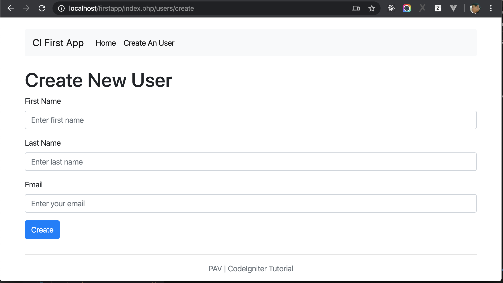

# Create an User

**Define**
`Base url` is a root url to access website home page. 

You now know how you can read data from a database using CodeIgniter, but you haven’t written any information to the database yet. In this section you’ll expand your user controller and model created earlier to include this functionality.

Before start, make some config to update base url for the firstapp by open `application/config/config.php`

Find `$config['base_url']` and update:

```php
$config['base_url'] = 'http://localhost/firstapp';
```

Add `$this->load->helper('url');` to function `__construct()` of User controller.

Open header file `application/views/header.php`, you will se 2 lines:

```HTML
<link rel="stylesheet" href="assets/css/bootstrap.min.css">
<link rel="stylesheet" href="assets/css/style.css">
```

We will change relative path in href to absolute by using function `base_url`. Now, replace 2 lines above by

```php
<link rel="stylesheet" href="<?php echo base_url('assets/css/bootstrap.min.css'); ?>">
<link rel="stylesheet" href="<?php echo base_url('assets/css/style.css'); ?>">
```

## Create a form

To input data into the database you need to create a form where you can input the information to be stored. Create the new view at `application/views/users/create.php`

```php
<main role="main" class="flex-shrink-0">
    <div class="container">
        <h1>Create New User</h1>
        <?php echo validation_errors(); ?>

        <?php echo form_open('users/create'); ?>
        <form action="" method="POST">
            <div class="form-group">
                <label for="name">First Name</label>
                <input type="text" class="form-control" name="first_name" id="first_name" placeholder="Enter first name">
            </div>
            <div class="form-group">
                <label for="last_name">Last Name</label>
                <input type="text" class="form-control" name="last_name" id="last_name" placeholder="Enter last name">
            </div>
            <div class="form-group">
                <label for="email">Email</label>
                <input type="text" class="form-control" name="email" id="email" placeholder="Enter your email">
            </div>
            <button type="submit" class="btn btn-primary">Create</button>
        </form>
        <?php echo form_close(); ?>
    </div>
</main>
```

There are only two things here that probably look unfamiliar to you: the `form_open()` function and the `validation_errors()` function.

The first function is provided by the [form helper](https://codeigniter.com/user_guide/helpers/form_helper.html) and renders the form element and adds extra functionality, like adding a hidden [CSRF prevention](https://codeigniter.com/user_guide/libraries/security.html) field. The latter is used to report errors related to form validation.

### Update Model

We need a method that writes the data to the database. You’ll use the Query Builder class to insert the information and use the input library to get the posted data. Open up the model created earlier `application/models/Users_model.php` and add the following:

```php
public function create_user()
{
    $this->load->helper('url');

    $data = array(
        'first_name' => $this->input->post('first_name'),
        'last_name' => $this->input->post('last_name'),
        'email' => $this->input->post('email')
    );

    return $this->db->insert('users', $data);
}
```

This new method takes care of inserting the user item into the database by using [Inserting Data](https://codeigniter.com/user_guide/database/query_builder.html#inserting-data) of [Query Builder](https://codeigniter.com/user_guide/database/query_builder.html). 

Let’s continue with preparing the record that is going to be inserted later, inside the `$data` array. Each element corresponds with a column in the database table created earlier. You might notice a new method here, namely the `post()` method from the [input library](https://codeigniter.com/user_guide/libraries/input.html). This method makes sure the data is sanitized, protecting you from nasty attacks from others. The input library is loaded by default. At last, you insert our `$data` array into our database.

### Update User Controller

Go back to your users controller `application/controllers/Users.php`. You’re going to do two things here, check whether the form was submitted and whether the submitted data passed the validation rules. You’ll use the [form validation](https://codeigniter.com/user_guide/libraries/form_validation.html) library to do this.

```php
public function create()
{
    $this->load->helper('form');
    $this->load->library('form_validation');
    $this->load->helper('url');

    $data["page_title"] = "Create New User";
    $this->form_validation->set_rules('first_name', 'First name', 'required');
    $this->form_validation->set_rules('last_name', 'Last name', 'required');
    $this->form_validation->set_rules('email', 'Email', array('required','valid_email'));

    if ($this->form_validation->run() === FALSE) {
        $this->load->view('header', $data); 
        $this->load->view('users/create', $data);
        $this->load->view('footer');
    } else {
        $this->users_model->create_user();
        redirect(base_url('/'));
    }
}
```

The code above adds a lot of functionality. The first few lines load the form helper and the form validation library. After that, rules for the form validation are set. The set_rules() method takes three arguments; the name of the input field, the name to be used in error messages, and the rule. In this case the first_name and last_name fields are required, email is required and match with email formats.

CodeIgniter has a powerful form validation library as demonstrated above. You can read [more about this library here](https://codeigniter.com/user_guide/libraries/form_validation.html).

And after all, the function `redirect(base_url('/'));` will navigate to base url http://localhost/firstapp/

### Make a link to Create User page

You have implemented `Create User Page`, let make a link on header to access this page.
Open header `application/views/header.php` and replace below code

```html
<li class="nav-item active">
    <a class="nav-link" href="/">Home <span class="sr-only">(current)</span></a>
</li>
```

by

```html
<li class="nav-item active">
    <a class="nav-link" href="<?php echo base_url(); ?>">Home</a>
</li>
<li class="nav-item active">
    <a class="nav-link" href="<?php echo site_url('users/create'); ?>">Create An User</a>
</li>
```

Now, access url http://localhost/firstapp/, click on `Create An User`, you will be navigated to `http://localhost/firstapp/index.php/users/create`



When the call is made to `http://localhost/firstapp/index.php/users/create`, the [Routing](https://codeigniter.com/user_guide/general/routing.html) calls to method `create` of User controller.

Default in CodeIgniter, an URL pattern that match:

```
WEBSITE_URL/[controller-class]/[controller-method]/[arguments]
```

You can [check more about URI Routing here](https://codeigniter.com/user_guide/general/routing.html)

Now, let push your souce code on Github

```bash
$ git add -A
$ git commit -m "create an user"
$ git push origin curd
```

## Conclustion

In this chapter, you learned:

- Writing data into database.
- Form helper.
- Form validation.
- URI Routing.

You learned how to create an user, let [go to next chapter to learn how to update an user](./ci_update.md)
