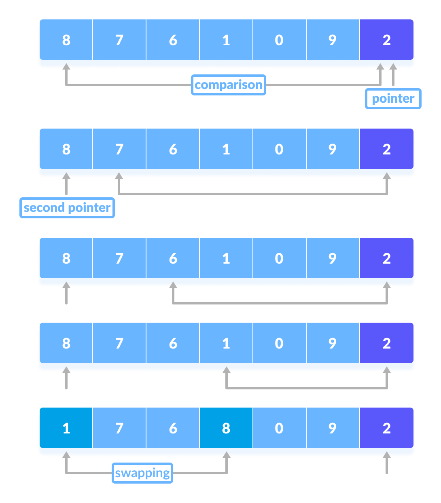
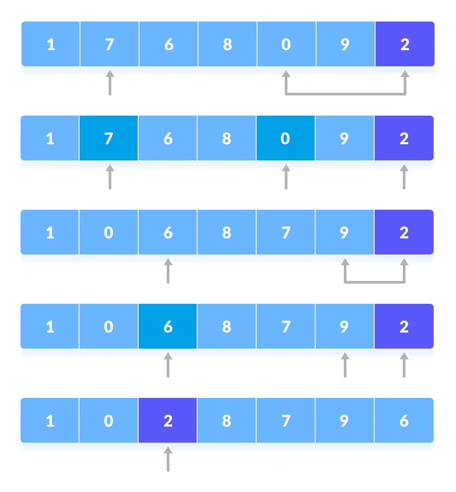
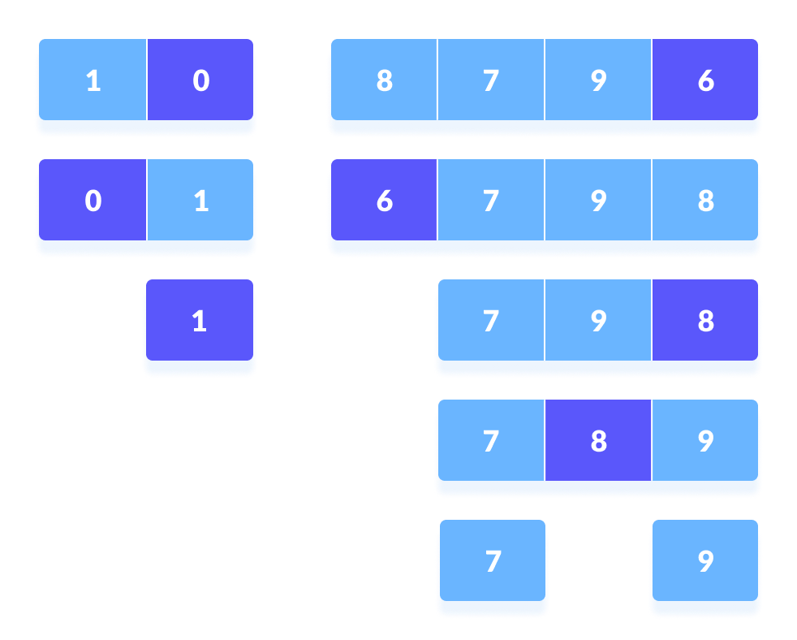
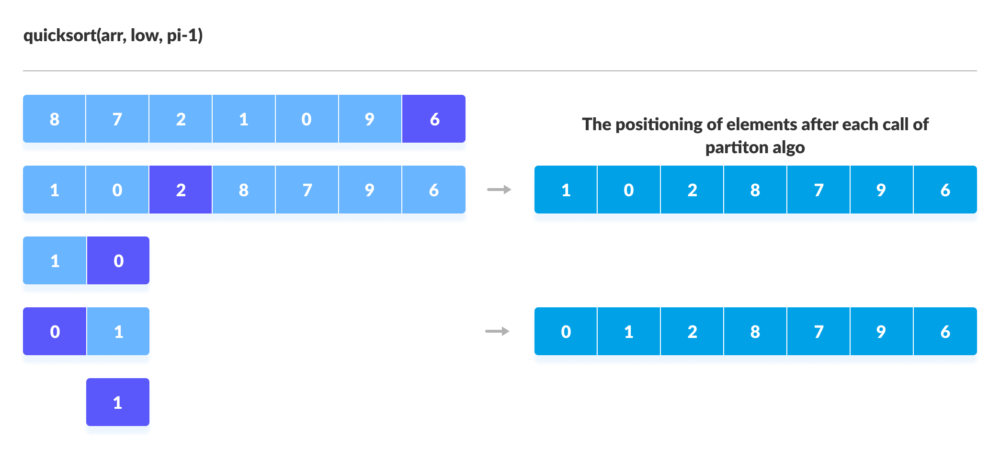
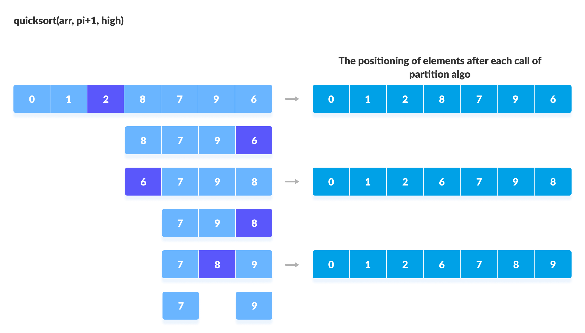

# QuickSort

QuickSort picks an element as pivot and partitions the given array around the picked pivot. There are many different versions of quickSort that pick pivot in different ways.

1. Always pick first element as pivot.
2. Always pick last element as pivot (implemented below)
3. Pick a random element as pivot.
4. Pick median as pivot.
The key process in quickSort is partition(). Target of partitions is, given an array and an element x of array as pivot, put x at its correct position in sorted array and put all smaller elements (smaller than x) before x, and put all greater elements (greater than x) after x. All this should be done in linear time.

## Pseudocode

### How QuickSort Works?

1. A pivot element is chosen from the array. You can choose any element from the array as the pviot element. Here, we have taken the rightmost (ie. the last element) of the array as the pivot element.


2. The elements smaller than the pivot element are put on the left and the elements greater than the pivot element are put on the right.


The above arrangement is achieved by the following steps.

a. A pointer is fixed at the pivot element. The pivot element is compared with the elements beginning from the first index. If the element greater than the pivot element is reached, a second pointer is set for that element.
 
b. Now, the pivot element is compared with the other elements. If element smaller than the pivot element is reached, the smaller element is swapped with the greater element found earlier.



c. The process goes on until the second last element is reached.
 
d. Finally, the pivot element is swapped with the second pointer.



3. Pivot elements are again chosen for the left and the right sub-parts separately. Within these sub-parts, the pivot elements are placed at their right position. Then, step 2 is repeated.



4. The sub-parts are again divided into smallest sub-parts until each subpart is formed of a single element.
 
5. At this point, the array is already sorted.

### Quicksort uses recursion for sorting the sub-parts.

On the basis of Divide and conquer approach, quicksort algorithm can be explained as:

1. Divide
The array is divided into subparts taking pivot as the partitioning point. The elements smaller than the pivot are placed to the left of the pivot and the elements greater than the pivot are placed to the right.

2. Conquer
The left and the right subparts are again partitioned using the by selecting pivot elements for them. This can be achieved by recursively passing the subparts into the algorithm.

3. Combine
This step does not play a significant role in quicksort. The array is already sorted at the end of the conquer step.


You can understand the working of quicksort with the help of an example/illustration below.





### Pseudo Code for recursive QuickSort function :

```php
quickSort(array, leftmostIndex, rightmostIndex)
  if (leftmostIndex < rightmostIndex)
    pivotIndex <- partition(array,leftmostIndex, rightmostIndex)
    quickSort(array, leftmostIndex, pivotIndex)
    quickSort(array, pivotIndex + 1, rightmostIndex)

partition(array, leftmostIndex, rightmostIndex)
  set rightmostIndex as pivotIndex
  storeIndex <- leftmostIndex - 1
  for i <- leftmostIndex + 1 to rightmostIndex
    if element[i] < pivotElement
      swap element[i] and element[storeIndex]
      storeIndex++
  swap pivotElement and element[storeIndex+1]
return storeIndex + 1
```

### The Quicksort function

We don’t have to return the array from the Quicksort function.
We have three arguments, the first, of course is the array we want to sort. The second is the left position, and the third is the right position. These are variables that point to array indices.

```php

function quicksort(&$array, $left, $right) {
    if($left < $right) {
        $pivotIndex = partition($array, $left, $right);
        quicksort($array,$left,$pivotIndex -1 );
        quicksort($array,$pivotIndex, $right);
    }
}

```

As you move through the function, after verifying that the left pointer is, indeed, to the left of the right pointer, the array is run through the partition function and a new pivot index is identified. 

The Quicksort will then call itself recursively until the if statement comes out false as it moves down the ‘left side’ of the pivot index. 
Once the if statement test false, the recursive stack pops, and the function continues, this time walking the ‘right side’ of the pivot index.

### Partition Algorithm

When dealing with the Quicksort, the goal of the algorithm is to split the array in half then compare the values from the going up, and the top coming down to that pivot value. 

When the value to the left of the pivot is greater and the value to the right of the pivot is less, the two values change place. This sort continues until the left hand index is greater than the right hand index, at which point, the value of the left hand index is returned.

```php

function partition(&$array, $left, $right) {
    $pivot = $array[$right];
    $i = $left -1;
    for ($j = $left; $j < $right; $j++) {
          if(($array[$j] < $pivot)){
            $i++;
            $temp = $array[$i];
            $array[$i] = $array[$j];
            $array[$j] = $temp;
          }
    }
    $temp = $array[$i + 1];
    $array[$i + 1] = $array[$right];
    $array[$right] = $temp;
    return ($i + 1);
}

```

There are two important items to note on this function:

1. The array is passed by reference into this function. This allows the array to be updated without returning it. If the language you write in doesn’t support pass by reference, there are ways around this, such as: making the array a global value (please don’t), and setting the return to be an array containing both the left hand index and the array we are sorting.

2. When calculating the pivotIndex I added the built-in command floor() to the calculation. Apparently, in C, integer division automatically appears to round down. When I did no rounding at all or the round() command, the script fell into an infinite loop. When I used floor(), the script performed as it expected.

## Following is the implementations of the Quick Sort:

The code is completed.

```php
<?php 
function partition(&$array, $left, $right) {
    $pivot = $array[$right];
    $i = $left -1;
    for ($j = $left; $j < $right; $j++) {
          if(($array[$j] < $pivot)){
            $i++;
            $temp = $array[$i];
            $array[$i] = $array[$j];
            $array[$j] = $temp;
          }
    }
    $temp = $array[$i + 1];
    $array[$i + 1] = $array[$right];
    $array[$right] = $temp;
    return ($i + 1);
}

function quicksort(&$array, $left, $right) {
    if($left < $right) {
        $pivotIndex = partition($array, $left, $right);
        quicksort($array,$left,$pivotIndex -1 );
        quicksort($array,$pivotIndex, $right);
    }
}

// A utility function to 
// print an array of size n 
function printArray(&$arr, $n) 
{ 
    for ($i = 0; $i < $n; $i++) 
        echo $arr[$i]." "; 
    echo "\n"; 
} 

$arr = array(12, 11, 13, 5, 6); 
$n = sizeof($arr); 
quicksort($arr, 0,count($arr) -1);
printArray($arr, $n); 
```
## Analysis

- Time Complexity: O(nLogn)
- Auxiliary Space: O(logn)
