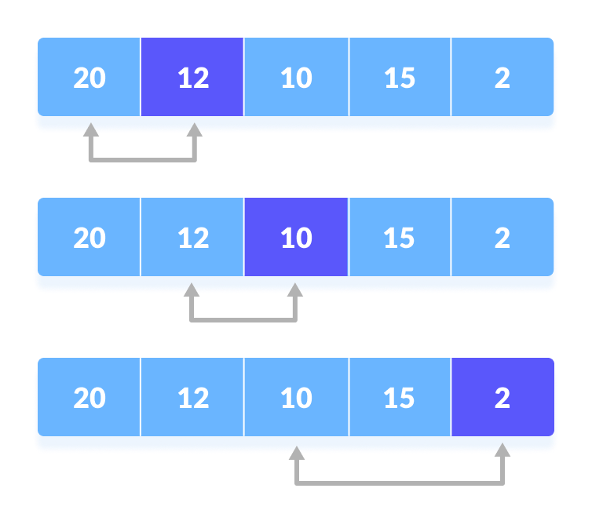
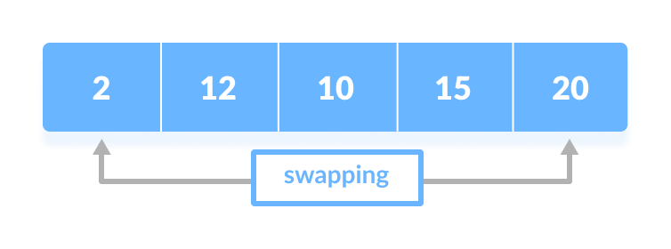
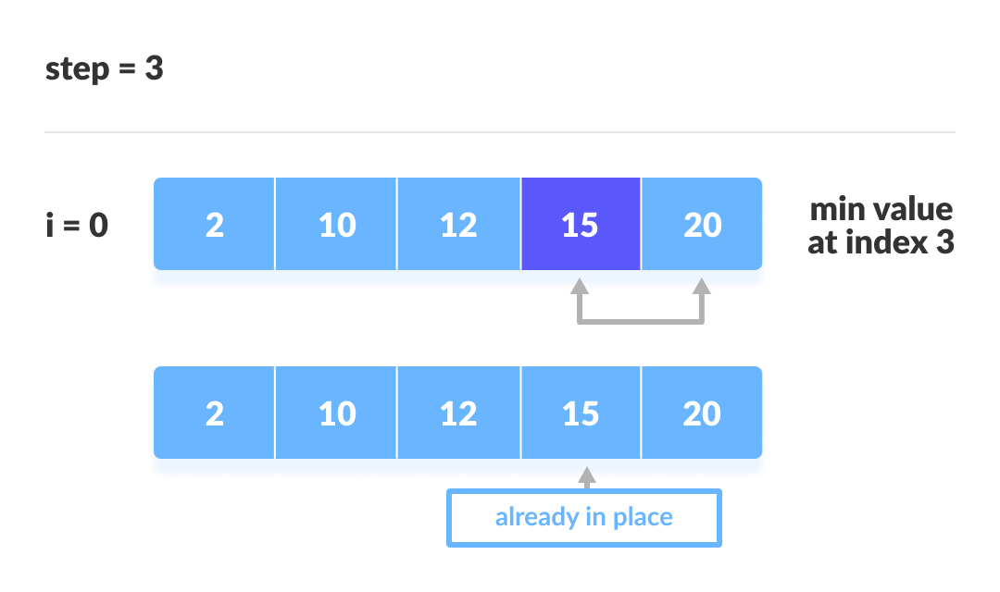

# Selection Sort

The selection sort algorithm sorts an array by repeatedly finding the minimum element (considering ascending order) from unsorted part and putting it at the beginning. The algorithm maintains two subarrays in a given array.

1) The subarray which is already sorted.
2) Remaining subarray which is unsorted.

In every iteration of selection sort, the minimum element (considering ascending order) from the unsorted subarray is picked and moved to the sorted subarray.

## Problem to Solve

Given a list of numbers as shown below, please sort them in ascending order.
```php
$numbers = [20, 12, 10, 15, 2];
```

## Pseudocode

### How Selection Sort Works?

1. Set the first element as **minimum**.


2. Compare **minimum** with the second element. If the second element is smaller than **minimum**, assign second element as **minimum**. Compare **minimum** with the third element. Again, if the third element is smaller, then assign **minimum** to the third element otherwise do nothing. The process goes on until the last element.



3. After each iteration, **minimum** is placed in the front of the unsorted list.



4. For each iteration, indexing starts from the first unsorted element. Step 1 to 3 are repeated until all the elements are placed at their correct positions.




### Pseudocode of Selection Sort algorithm can be written as follows:

```php
selectionSort(array, size)
  repeat (size - 1) times
  set the first unsorted element as the minimum
  for each of the unsorted elements
    if element < currentMinimum
      set element as new minimum
  swap minimum with first unsorted position
end selectionSort
```

## Following is the implementations of the Selection Sort:
```php
<?php 
// PHP program for implementation  
// of selection sort  
function selection_sort(&$arr, $n)  
{ 
    for($i = 0; $i < $n ; $i++) 
    { 
        $low = $i; 
        for($j = $i + 1; $j < $n ; $j++) 
        { 
            if ($arr[$j] < $arr[$low]) 
            { 
                $low = $j; 
            } 
        } 
          
        // swap the minimum value to $ith node 
        if ($arr[$i] > $arr[$low]) 
        { 
            $tmp = $arr[$i]; 
            $arr[$i] = $arr[$low]; 
            $arr[$low] = $tmp; 
        } 
    } 
} 
  
// Driver Code 
$arr = array(64, 25, 12, 22, 11); 
$len = count($arr); 
selection_sort($arr, $len); 
echo "Sorted array : \n";  
  
for ($i = 0; $i < $len; $i++)  
    echo $arr[$i] . " ";  
  
?>  
```

## Output 
```php
Sorted array:
11 12 22 25 64
```

## Analysis

- Time Complexity: O(n^2)
- Auxiliary Space: O(1)
